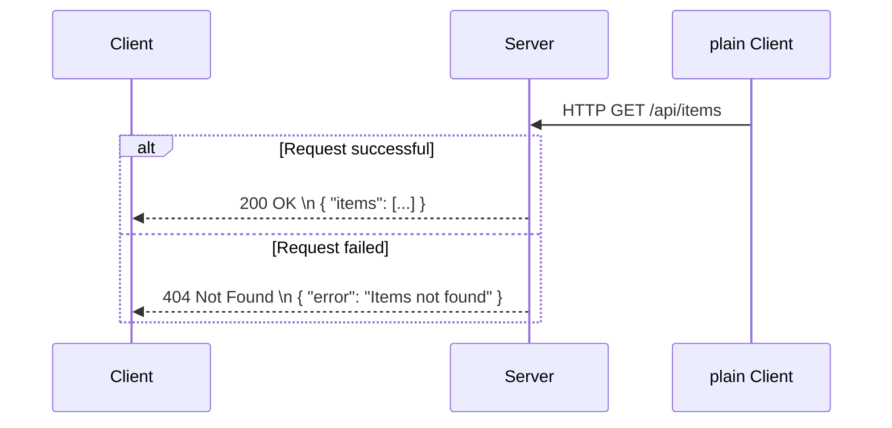
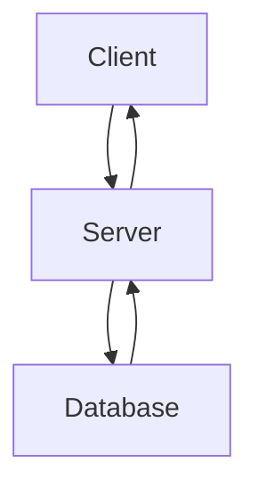
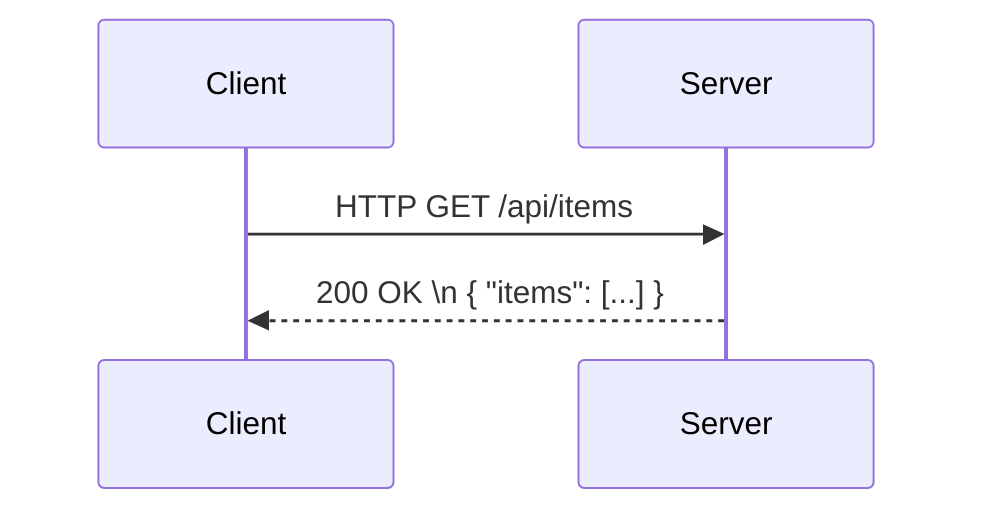

# API Demo

## Nav Bar

- [HTTP Calls](/#http-calls)
- [Graph](/#graph)
- [Sequence](/#sequence)

## HTTP Calls

```mermaid
sequenceDiagram
    participant Client
    participant Server

   plain Client->>Server: HTTP GET /api/items
    alt Request successful
        Server-->>Client: 200 OK \n { "items": [...] }
    else Request failed
        Server-->>Client: 404 Not Found \n { "error": "Items not found" }
    end
```

## Graph

```mermaid
graph TD
    A[Client] --> B[Server]
    B --> C[Database]
    C --> B
    B --> A
```

## Sequence

```mermaid
sequenceDiagram
    participant Client
    participant Server

    Client->>Server: HTTP GET /api/items
    Server-->>Client: 200 OK \n { "items": [...] }
```
